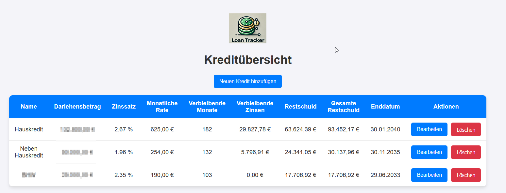

# Loan Tracker

**Loan Tracker** ist eine Anwendung, die entwickelt wurde, um die Verwaltung und Übersicht über mehrjährige Kredite zu erleichtern. Mit dieser Anwendung haben Sie sofort im Blick:

- **Wann Ihre Kredite endgültig ablaufen**
- **Wie hoch die verbleibenden Zahlungen sind**
- **Wie viel Zinsen und Tilgung Sie noch leisten müssen**

Sie müssen nicht länger in Ihren Unterlagen suchen – alle wichtigen Informationen sind zentral und übersichtlich auf einer Oberfläche dargestellt.

---

## 🛠️ Funktionen

- **Übersicht aller Kredite**: 
  - Zeigt auf einen Blick die verbleibende Laufzeit, die Restschuld und das genaue Enddatum jedes Kredits.
- **Berechnung von Zinsen und Tilgung**: 
  - Automatische Berechnung der noch zu zahlenden Zinsen und der Tilgungsanteile.
- **Flexibilität bei der Eingabe**: 
  - Geben Sie entweder die monatliche Rate oder die Laufzeit an – die App berechnet automatisch den Rest.
- **Bearbeitung bestehender Kredite**:
  - Kredite können jederzeit nachträglich aktualisiert werden, falls sich Konditionen ändern.
- **Startkapital berücksichtigen**:
  - Ziehen Sie vorhandenes Eigenkapital vom Darlehensbetrag ab.

---

## 🚀 Vorteile

- **Schnelle Übersicht**: 
  - Keine lästige Suche in Unterlagen mehr – die wichtigsten Informationen sind sofort verfügbar.
- **Zeitersparnis**: 
  - Automatische Berechnung von Laufzeit, Zinsen und Restschuld spart Zeit.
- **Transparenz**: 
  - Sehen Sie genau, wie lange Sie noch zahlen müssen und wie viel Geld insgesamt offen ist.

---

## 📦 Installation

1. **Klonen Sie das Repository**:
   ```bash
   git clone git@github.com:username/loan-tracker.git
   cd loan-tracker
   docker-compose up -d


